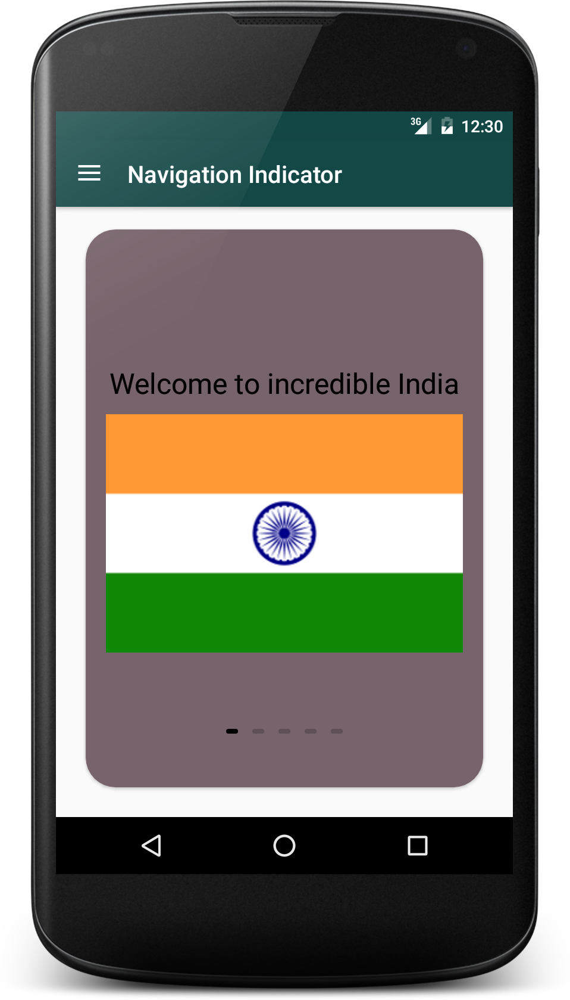
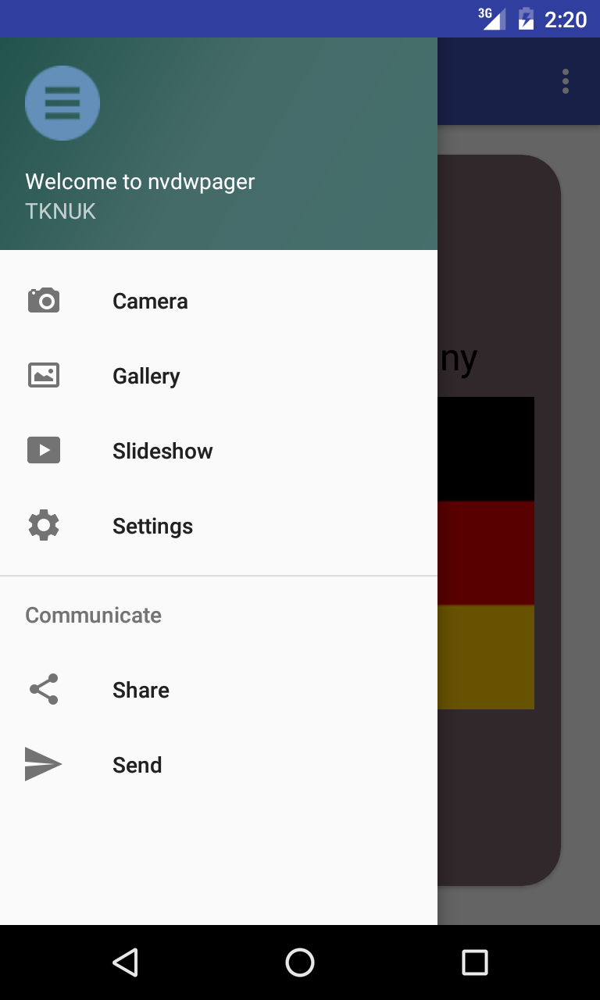
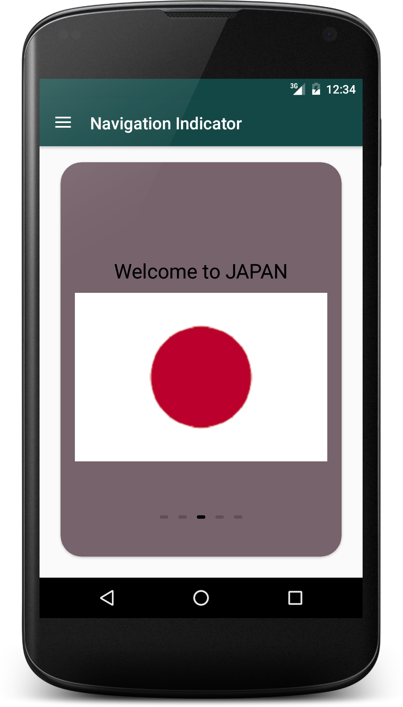

# NavigationDrawerWithViewPagerIndicator

- Simple Android navigation drawer
- [ongakuer CircleIndicator][1] used.
- Introduced Cardview inside the CircleIndicator viewpager.

For demo check in **Play Store** - <a href="https://play.google.com/store/apps/details?id=com.tknuk.cardnavigation">Navigation with Indicator</a>

Screenshots: 
-----

 

Reference:
[https://github.com/ongakuer/CircleIndicator][1]

# License

      Copyright (C) 2016, 23 April.
       Anybody can access and change this one. 

[1]: https://github.com/ongakuer/CircleIndicator
[2]: https://github.com/TKNUK026/NavigationDrawerWithViewPagerIndicator/blob/master/nvdwpager_1.png
[3]:https://github.com/TKNUK026/NavigationDrawerWithViewPagerIndicator/blob/master/nvdwpager_2.png
[4]:https://github.com/TKNUK026/NavigationDrawerWithViewPagerIndicator/blob/master/nvdwpager_3.png
