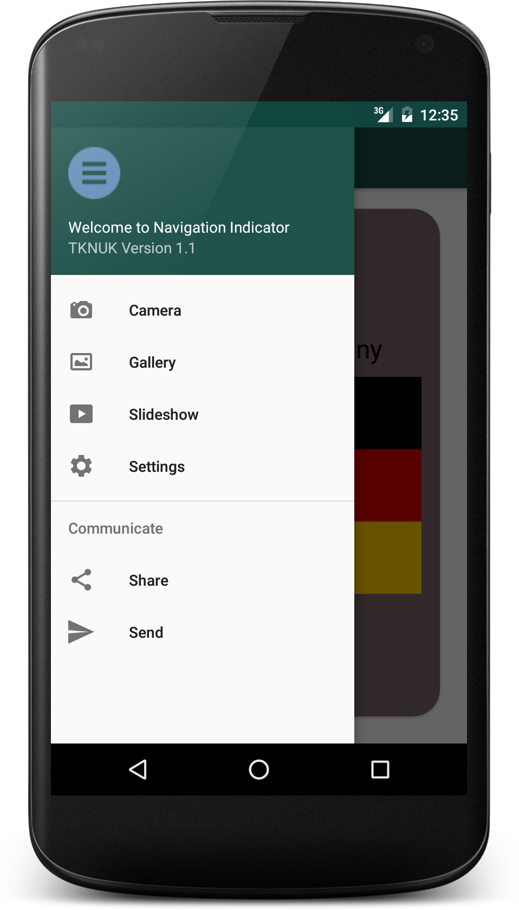

# NavigationDrawerWithViewPagerIndicator

In this used Android default Navigation Drawer with [ongakuer CircleIndicator][1] integration

Introduced Cardview inside the CircleIndicator viewpager. 

Screenshots: 
-----
 
 
 

Reference:
[https://github.com/ongakuer/CircleIndicator][1]

# License

      Copyright (C) 2016, 23 April.
       Anybody can access and change this one. 

[1]: https://github.com/ongakuer/CircleIndicator
[2]: https://github.com/AnkushTech026/NavigationDrawerWithViewPagerIndicator/blob/master/nvdwpager_1.png
[3]:https://github.com/AnkushTech026/NavigationDrawerWithViewPagerIndicator/blob/master/nvdwpager_2.png
[4]:https://github.com/AnkushTech026/NavigationDrawerWithViewPagerIndicator/blob/master/nvdwpager_3.png
